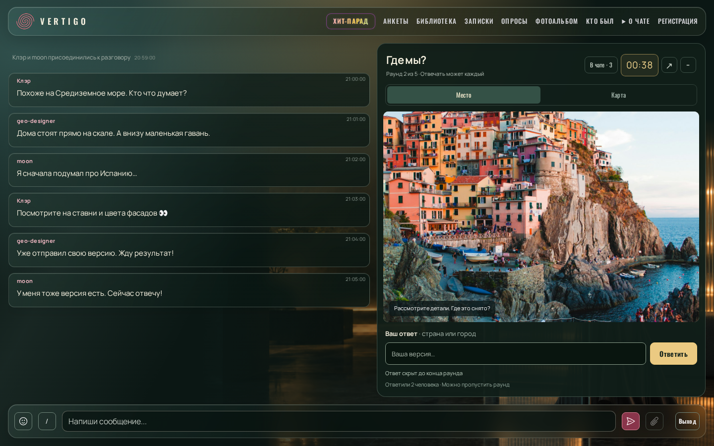
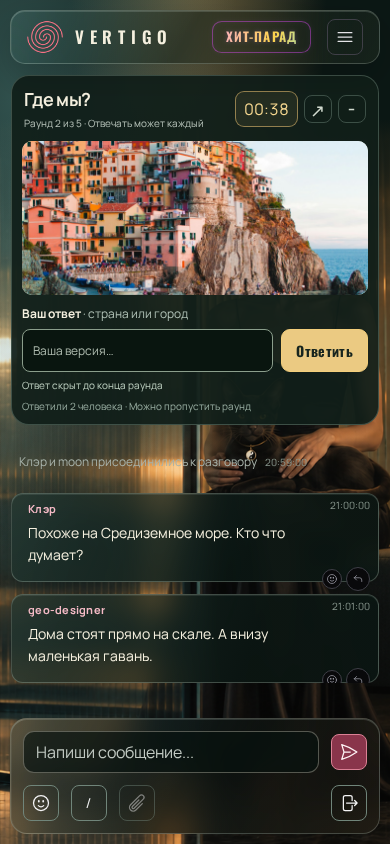

# Геоигра в общем чате — договорённости и визуальный эталон v1

Зафиксировано 2026-10-06 по обсуждению с пользователем. Перед любой работой над
геоигрой читать этот документ. Он закрепляет выбранное направление и макеты;
не означает, что игра уже реализована или прошла приёмку.

## 1. Согласованный формат

- Игра наподобие GeoGuessr проходит прямо в общем чате.
- Приглашения, обязательное вступление и отдельное лобби не нужны.
  Отвечает тот, кто хочет и находится у экрана. Раунд можно пропустить.
- Участие открыто в ходе раунда; список игроков не фиксируется заранее.
  Нельзя завершать раунд по условию «ответили все участники лобби».
- Обсуждение идёт в обычной ленте чата, одновременно с просмотром места.
- Изображение/карта и игровые контролы остаются на месте при прокрутке обсуждения.
  Игра не оформляется сообщением, которое уезжает вверх по истории.
- Изображение достаточно крупное для рассматривания деталей. Нельзя заменять
  выбранную композицию маленькой карточкой ради упрощения реализации.
- Отвечать можно словами. На телефоне — **только словами**.
  Отдельное поле «Ваш ответ» не заменяет обычный ввод сообщения в чат.
- При открытии игры боковой список участников скрывается, освобождая место.
  При сворачивании игры возвращается штатное расположение списка для данного экрана.
- В этой поверхности не используется слово «Чатланы». В выбранном макете
  для доступа к списку показана кнопка **«В чате · 3»**; число динамическое.
- Сохраняется выбранный дизайн на основе текущего интерфейса чата.
  Шапку, навигацию, общие стили, карточки сообщений и композер не переосмысливать.

Рабочее название в макете — «Где мы?». Общая стилистика и компоновка выбраны
пользователем; надписи и демонстрационные данные не устанавливают сами по себе
правила начисления очков или окончательную длительность игры.

## 2. Что именно закреплено в макетах

**Неизменяемый эталон — [reference-v1](reference-v1/manifest.json).**
Это побайтовая копия последнего показанного варианта `mock-final`, его ресурсов,
четырёх исходных экранов и исходников рендера. Контрольные суммы и размеры PNG
сохранены в manifest. Файлы этой копии разрешены к хранению в Git локальным
`.gitignore`; они не должны остаться только в игнорируемых временных результатах.
Коммит этим документом не выполняется и не разрешается автоматически.

| Экран | Размер | Основное состояние | Дополнительные эталоны |
|---|---|---|---|
| Desktop | 1440×900 | [Место](reference-v1/mock-final/1440x900-place.png) | [Карта](reference-v1/mock-final/1440x900-map.png), [свёрнуто](reference-v1/mock-final/1440x900-collapsed.png) |
| Tablet, портрет | 768×1024 | [Место](reference-v1/mock-final/768x1024-place.png) | [Карта](reference-v1/mock-final/768x1024-map.png), [свёрнуто](reference-v1/mock-final/768x1024-collapsed.png) |
| Телефон, портрет | 390×844 | [Место и текстовый ответ](reference-v1/mock-final/390x844-place.png) | [Ответ принят](reference-v1/mock-final/390x844-answered.png), [свёрнуто](reference-v1/mock-final/390x844-collapsed.png) |
| Landscape | 844×390 | [Место](reference-v1/mock-final/844x390-place.png) | [Карта — есть оговорка ниже](reference-v1/mock-final/844x390-map.png), [свёрнуто](reference-v1/mock-final/844x390-collapsed.png) |

Для каждого размера также сохранены `*-place-viewport.png` и
`*-place-bottom.png`: панель при прокрутке обсуждения. Полный перечень — в manifest.
В `reference-v1/baseline` лежат исходные экраны чата для проверки соседней поверхности.

### Desktop

### Телефон

### Визуальные границы

- На desktop — обсуждение и крупная игровая панель рядом; на портретных tablet
  и телефоне — игровая панель над обсуждением, обычный ввод чата внизу.
- Сохранять геометрию панели, пропорции изображения, отступы, типографику,
  цвета и иерархию выбранных PNG. Точные параметры — в замороженном
  [proposal.css](reference-v1/source/proposal.css).
- В макете предусмотрены вкладки «Место» / «Карта» на больших экранах,
  таймер, сворачивание, поле ответа, счётчик ответивших и возможность пропуска.
- Состояние принятого ответа показывает собственную версию и надпись о её
  приватности до конца раунда. При реализации этой поверхности нельзя отправлять
  игровую версию обычным публичным сообщением. Обсуждение в чате остаётся публичным.
- Кнопка «Изменить ответ» присутствует в макете. Окончательные правила изменения
  и серверная граница приёма должны быть определены до реализации.

### Известное расхождение и отсутствующие состояния

**Телефон остаётся с текстовыми ответами и в горизонтальной ориентации.**
Существующий PNG 844×390 показывает вкладку карты, поскольку статический макет
различал ширину, а не класс устройства. Это зафиксированный пробел макета,
а не разрешение отменить требование пользователя. Перед реализацией телефона
в landscape нужен отдельный исправленный PNG и согласование; сохранённый v1
не переписывать. Для desktop/tablet карта остаётся выбранным направлением,
но её правила ответа требуют уточнения.

В выбранных PNG ещё нет окончательных решений для:

- поповера участников и доступа к нему на телефоне/низком экране;
- открытой экранной клавиатуры и фокуса поля ответа;
- раскрытого изображения;
- загрузки, отсутствующего снимка, ошибки, переподключения;
- начала игры, результата раунда и итогов игры.

Наличие иконки или кода `.expanded` не заменяет макет состояния. Перед реализацией
этих поверхностей нужен `ui-designer` с новыми PNG и критериями приёмки.
Нельзя объявить отсутствующие состояния утверждёнными или дорисовать их
самостоятельно при написании компонентов.

## 3. Данные и пополнение

Пользователь выбрал community-наборы с переносом исходных ID для пополнения
без повторных локаций. Подготовленный каталог и инструкция:
[data/geo/README.md](../../../data/geo/README.md).

- Сохранять автора, источник, лицензию, исходный ID карты, ID панорамы, ракурс,
  теги и закреплённую версию экспорта.
- Постоянный внутренний ID локации не менять при повторном импорте.
  Общая панорама в нескольких наборах не должна давать несколько игровых локаций.
- Использовать имеющийся импортёр; не делать повторное добавление всех строк
  и не назначать ID по номеру строки. Конфликтующие идентификаторы требуют разбора.
- Повтор той же версии должен давать 0 добавлений и 0 обновлений.
- Импортированы Gorgeous Touge Roads — 5 835 записей и An Arbitrary World —
  4 955 записей. Вторая карта алгоритмическая, а не ручная подборка A Community World.
- Исходные ID относятся к **Google Street View**. Предыдущая рекомендация
  MapillaryJS в исследовании движков не является принятым решением для этих ID:
  их нельзя передать Mapillary как эквивалентные изображения.
- Каталог — подготовленные исходные данные. Доступность панорам, пригодность
  кадров, рабочие авторские метки и правильные текстовые ответы ещё надо проверить.
  Нельзя называть все 10 790 записей проверенными готовыми вопросами.

Фото Манаролы и OSM-карта в макете — демонстрационные ресурсы для визуального
эталона, не выбранный источник игровых вопросов. Условия показа реальных снимков
проверяются при подключении провайдера; лицензия списка координат их не заменяет.

## 4. Что ещё не согласовано

Не принимать решения ниже за уже утверждённые требования:

- Кто и как запускает игру, ограничения частоты, остановка и переходы между играми.
- Окончательное количество и длительность раундов. В PNG показано «2 из 5»;
  ранее предлагалось 5 раундов по 60 секунд, но отдельного подтверждения параметров нет.
  «00:38» — значение fixture, а не полная длительность раунда.
- Баллы за страну/город, допустимая точность, ничьи и влияние скорости ответа.
- Преобразование метки карты в ответ и равные условия с текстовым вводом.
- Синонимы, языки, опечатки, одноимённые города и допустимые варианты ответа.
- Можно ли менять ответ, сколько раз и до какого момента; содержание раскрытия
  после раунда и срок хранения результатов.
- Способ показа Google-панорам, ключи/расходы и поведение недоступных снимков.

Уточнять эти вопросы перед зависимым этапом. Не расширять согласованный интерфейс
новыми режимами, рейтингами, приглашениями или настройками по собственной инициативе.

## 5. Порядок реализации и приёмки

1. Читать этот документ, исходные PNG, [HANDOFF](HANDOFF.md),
   [план миграции](../../go_react_migration_plan.md) и правила репозитория.
2. Для нового/недостающего UI-состояния сначала применять `ui-designer`.
   Изменения утверждённой композиции — только после явного согласия пользователя.
3. Не перезаписывать `reference-v1` и его manifest, не подгонять исходный макет
   под реализацию. Рабочие рендеры хранить отдельно. Согласованное изменение
   оформить новой версией эталона с описанием отличий и основанием в решении пользователя.
4. Реализовывать по Go + React архитектуре; рабочие инструкции в `/help` и у Кармика
   обновлять вместе с появлением действующей функции, не заранее.
5. Выполнить целевые проверки затронутого этапа в закреплённом Linux Docker.
   Основной агент обязательно проверяет UI через `verifier`.
6. Перед визуальной приёмкой дизайнер получает для каждого нужного состояния
   исходный PNG, актуальный Docker browser PNG того же размера, side-by-side
   и overlay/diff. Без полного комплекта, при разных fixture/auth или расхождении
   с пользовательским скриншотом — `REJECTED`. Проверка должна быть строгой,
   near-pixel-perfect; сборка и unit-тесты её не заменяют.
7. Проверять неподвижность панели при прокрутке, переключение/сворачивание,
   восстановление списка, ввод с клавиатурой, приватность ответа и отсутствие
   изменений соседнего чата. Пока состояние не спроектировано и не проверено,
   его нельзя считать принятым.

Условия сравнения v1: `/chat`, Chromium, zoom 100%, DPR 1, `ru-RU`,
`Europe/Moscow`, тема `vertigo_glass`, рамки включены; гостевой вход
`geo-<timestamp>`, fixture пользователей `geo-designer`, `Клэр`, `moon`.
Раунд 2/5, таймер 00:38, ответили двое. Точные сообщения и подмена данных
сохранены в `reference-v1/source/capture.mjs` и `render.mjs`.

**Текущее состояние:** макеты и импорт community-каталога подготовлены.
Работающая игра и её визуальная приёмка ещё не выполнены. Этот документ
не даёт отдельного разрешения на commit, push или production.

## Дополнения пользователя — 6 октября 2026, продолжение реализации

- На каждый раунд даётся **5 минут** вместо 60 секунд. Пять раундов, между ними 10 секунд раскрытия.
- Вопрос показывается интерактивной Street View панорамой: осмотр, масштаб и переходы по доступным стрелкам. У отдельных снимков соседних точек может не быть. «К началу» возвращает в стартовую панораму; правильный ответ всегда относится к исходному месту. Перемещение одного игрока не двигает остальных. На телефоне ответ по-прежнему только словами.
- Кнопка **«Закрыть ×»** явно закрывает игровую панель только для текущего посетителя, восстанавливает список участников; общий раунд продолжает идти. `/гео` открывает снова.
- В обычном подборе приоритет у городских улиц и населённых мест. Горные трассы не должны преобладать. Текущая реализация сначала рассматривает общий community-набор, а не специализированный Touge; среди проверенных кандидатов предпочитает до четырёх мест с городом, улицей и номером здания в адресных компонентах. Это приблизительный признак застройки, не визуальная классификация снимков. При недостатке таких панорам используются остальные валидные community-точки, без обещания точной доли городов.
- Постоянный топ геоигры — сумма очков зарегистрированного аккаунта за завершённые раунды всех партий, без скоростного бонуса. Гости участвуют в партии и её итогах, но не в постоянном топе. Смена/обновление браузера и повторные запросы не дублируют начисления. При равенстве очков выше тот, кто сыграл меньше раундов; окончательный порядок стабилен по аккаунту.
- В меню чата добавляется **«Рейтинги»**: единая страница с отдельными таблицами **«Где мы?»** и **«Тетрис»**. Баллы разных игр не суммируются. У тетриса сохраняются соревнования/соло и всё время/месяц.
- До реализации обновлённого UI сохранены эталоны `design-v4`: интерактивная панорама, закрытие, пункт меню, отдельная страница рейтингов, desktop/tablet/mobile/landscape/keyboard и прокрутка. Предыдущие эталоны не удаляются; соответствующие изменённые состояния замещаются v4.

Статус: реализация и Docker-проверки в работе; эти дополнения не означают публикацию или завершение визуальной приёмки.

### Вход в чат во время игры

Если раунд уже запущен, новый посетитель видит только компактную полоску с названием, номером раунда, временем и кнопкой «Открыть». Панорама не загружается до открытия. Нажатие или `/гео` раскрывает игру; перезагрузка чата снова начинает со свёрнутого состояния. Если активной игры нет, включая уже завершённую партию, автоматически ничего не показывается. Итоги остаются доступны тем, кто открыл игру, и через `/гео`. До реализации сохранены 15 PNG `design-v5` для пяти размеров и трёх положений прокрутки; все остальные решения v4 сохранены.
